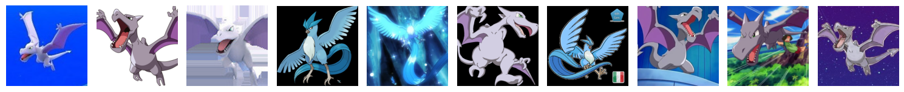
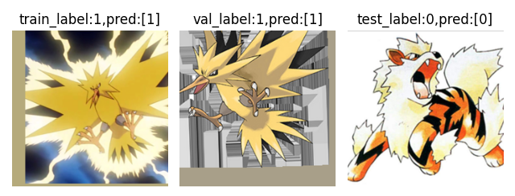
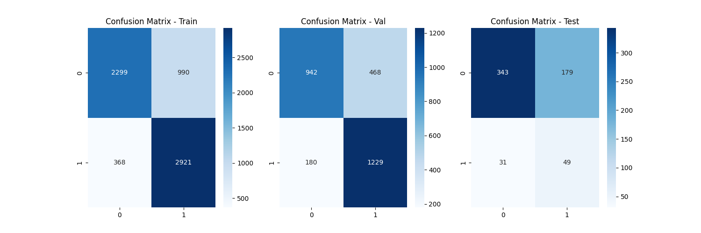
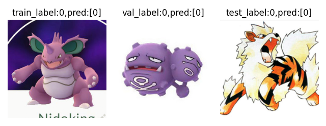
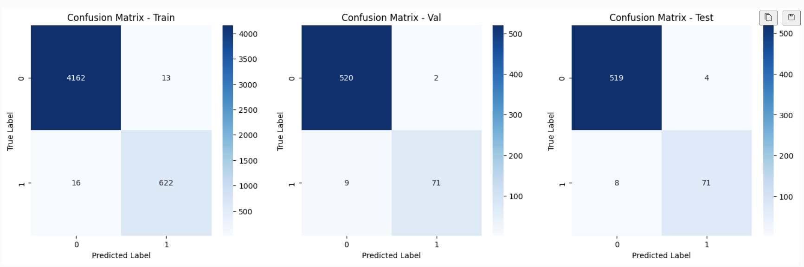
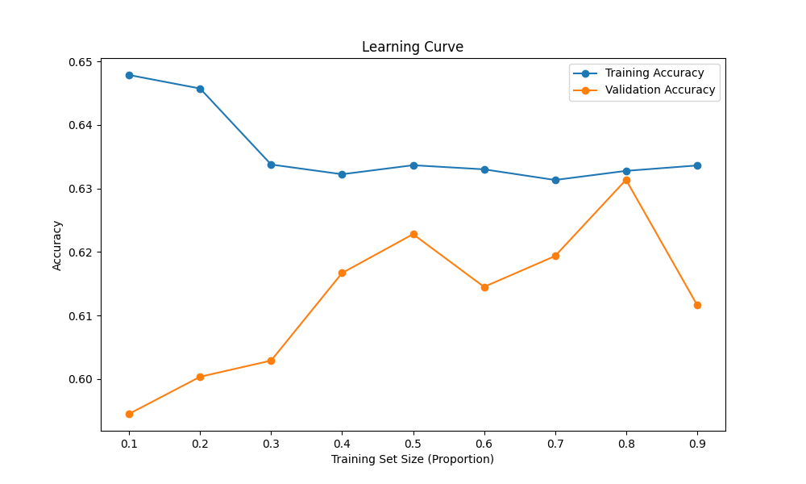
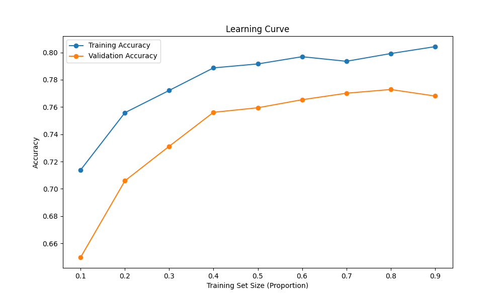
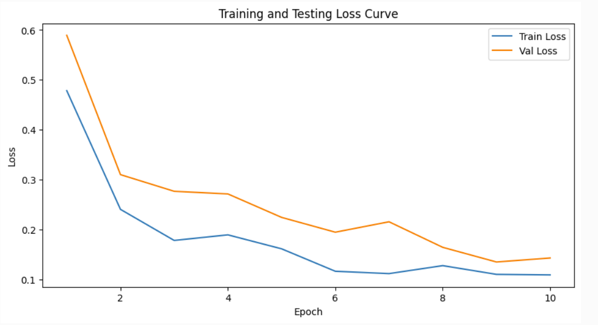

# CSE151A Pokémon Classification Report

## Introduction

In the modern era, where visual data dominates many aspects of technology, image classification has become a cornerstone of machine learning applications. This project focuses on the supervised classification of Pokémon characters as winged or wingless, using Kaggle's "7,000 Labeled Pokémon" dataset. This dataset, containing 150 Pokémon species with 30–45 images each, provides a fun and engaging platform to explore real-world challenges in image-based predictive modeling.

We chose this project because it combines technical rigor with creativity, making the learning process both practical and enjoyable. Building a model to classify visual features of Pokémon characters requires advanced techniques like Convolutional Neural Networks (CNNs) and image preprocessing (e.g., resizing, augmentation, normalization). Through experimentation with model architectures and optimizers, we’ll tackle challenges such as class imbalance and overfitting.

The broader impact of a strong predictive model extends far beyond Pokémon. Image classification powers technologies in fields such as healthcare, autonomous vehicles, and e-commerce, where precise visual understanding drives critical decisions. By applying machine learning techniques to this imaginative dataset, we demonstrate how predictive models can be both impactful and accessible, inspiring further innovation in computer vision.

## Methods

### EDA Results

After deciding on our topic and dataset, we took some time to explore our dataset. At first glance, there seemed to be many instances of "bad" or "incorrectly formatted" data that needed to be manually checked and removed from our dataset. These were removed from the dataset. We also looked into several types of parameters that would affect our model, such as winged/non-winged frequency, size/dimensions, and background diversity.

- Winged/Non-Winged: We first graphed the frequency of each of the two classes. Results showed that were much more examples of non-winged than winged Pokémon. We would either have to sample an equal number of images from both sets or use a weight balance optimizer to accomodate for this imbalance.

*Figure 1: Class distribution showing imbalance between winged and non-winged Pokémon.*
 

- Image Dimensions: Our images were of various dimensions, so these needed to be resized and standardized to be used with our model.

*Figure 3: Scatter plots showing image dimensions before and after resizing to 224x224 pixels.*
 

- Background/type diversity: When looking at different images of the same Pokémon, it is clear that different images come from different sources, for example 3D rendering, plushies, cartoon/anime, or Pokémon cards. These differences, along with the associated image backgrounds of each type of picture, were analyzed. The images and their backgrounds needed to be normalized in order to eliminate the possibility of them affecting the results of our model.

### Data Preprocessing

First, images that were manually pre-labeled as "bad data" were removed from our dataset. Some images in the dataset had formats that were unsupported by PIL that were also removed. Example of such "bad data" are included in Figure 5 below. These particular examples showcase non-winged Pokémon that have "wing-like" qualities. After some discussion, we decided to remove these types of images from the dataset.

*Figure 5: Examples of Pokémon images marked as 'bad data,' which were excluded during preprocessing.*
 

Additionally, some images had different sizes, so we decided to resize all of the images to 224x224 pixels.

*Figure 6: Examples of Pokémon images after resizing to 224x224 pixels.*
 

Then, pixels in each of the images were normalized. Multiple functions were made to use different forms of pixel normalization for different models, such as z-score and min-max normalization. The results of each type of normalization were visualized by plotting 10 examples images for each method.

*Figure 3: Examples of Pokémon images after applying Z-score and Min-Max normalization.*
 

Additionally, a function was created for data augmentation. Functions from the PIL used to implement flip/rotation/shifting changes were condensed into a single function to be used on certain images for training or testing.

*Figure 4: Examples of Pokémon images after applying data augmentation, including rotations, flips, and shifts.*
 

Finally, methods to manipulate the dataset for use with our models were implemented. Random sampling from both winged and non-winged Pokémon was decided to be used as the method to resolve the imbalances between the two classes of Pokémon. The dataset was also split into training/validation/testing sets with a 80/10/10 split, respectively. We wanted to serialize our two classes, "winged" and "non-winged", so we gave each class a numerical classification, with 0 being "non-winged" and 1 being "winged". All of the data preprocessing and augmentation described above was then applied on the dataset for the appropriate models.

### Models

#### Logistic Regression

The first model we decided to use was Logistic Regression. Logistic Regression is a supervised learning algorithm used for binary classification. Since Logistic Regression takes 1-dimensional inputs, the image data was flattened into a 1D vector in order to fit into our model.

- max_iter('100'): This defines the maximum number of iterations taken for the solvers to converge. We chose a default value of 100.

- solver('lbfgs'): This solving algorithm can handle large datasets and is the default sorting algorithm, which ended up being our choice as well. 

- penalty('l2'): Our solving algorithm supports only L2 regularization or none. An L2 regulation was added to prevent overfitting and promote simpler models.

- class_weight('balanced'): Even thought the input data for this model is randomly sampled and balanced during preprocessing, the 'balanced' option is chosen to automatically balance the weights of each class frequency.

- C('best_C'): From testing, the best regularization is evaluated, and the best regularization complexity is chosen and added as a parameter into the model. 

#### SVM (Support Vector Machine)

SVM is a supervised learning algorithm used for both classification and regression, though we use it in this project for regression. SVM works by finding the optimal decision boundary (hyperplane) between two classes in a feature space. This type of classification is effective for classification tasks like ours with high-dimensional spaces and noisy data.

- kernel('rbf'): The RBF kernel is suitable for image data and can help distinguish subtle features in images, like shapes resembling wings.

- C('best_C'): As stated before, the best regularization complexity was chosen through testing.

- probability('True'): Probability estimates are enabled in order to provide a confidence score for each classification.

- class_weight('balanced'): Even thought the input data for this model is randomly sampled and balanced during preprocessing, the 'balanced' option is chosen to automatically balance the weights of each class frequency.

#### Residual Network 18 (ResNet18)

ResNet18 is a neural network architecture that works well with image classification tasks. It's known for its ability to train deep networks and introduces skip connections to allow gradients to flow more effectively throughout its networks. It fits well for our image classification task. Two different optimizers, Adam and RMSProp, were extensively tested with different learning rates and weight decays to minimize loss and prevent overfitting.

- pretrained('True'): This option pretrains the model with weights trained on ImageNet, which allows the models to start with generalized visual features, only requiring fine-tuning for our project.

- lr(various): Various learning rates were tested to optimize training speed and overshooting to fit the best with our project.

- wd(various): Various weight decays were tested to reduce overfitting to fit the best with our project.

## Results

The performance of the classification models—Logistic Regression, Support Vector Machine (SVM), and Residual Network 18 (ResNet18)—was evaluated using precision, recall, f1-score, and accuracy on the training, validation, and test datasets. Below are the results:

### Logistic Regression

*Figure 7.1: Results of Logistic Regression on both non-winged (0) and winged (1) Pokémon*
 

- **Training Accuracy**: 63%
- **Validation Accuracy**: 63%
- **Test Accuracy**: 58%
- **Key Observations**:
  - Logistic Regression achieved moderate precision and recall on the training and validation datasets.
  - On the test set, the model struggled with the minority class (winged Pokémon), showing poor precision (17%) and recall (53%).
 

*Figure 7.2: Confusion matrix for Logistic Regression showing classification performance on test data.*
 

*Figure 7.3: Example Pokémon predictions for Logistic Regression, showing true and predicted labels.*
 

### Support Vector Machine (SVM)
- **Training Accuracy**: 80%
- **Validation Accuracy**: 77%
- **Test Accuracy**: 69%
- **Key Observations**:
  - SVM demonstrated strong performance on the training and validation datasets, reflecting good generalization.
  - On the test set, its performance was better than Logistic Regression but still struggled with minority class precision (24%) and recall (62%).

*Figure 8.1: Confusion matrix for Support Vector Machine (SVM) showing classification performance on test data.*
 

*Figure 8.2: Example Pokémon predictions for SVM, showing true and predicted labels.*
 

### Residual Network 18 (ResNet18)

*Figure 7.1: Results of ResNet18 on both non-winged (0) and winged (1) Pokémon*
 

- **Training Accuracy**: 99%
- **Validation Accuracy**: 99%
- **Test Accuracy**: 98%
- **Key Observations**:
  - ResNet18 outperformed all other models, achieving nearly perfect accuracy across datasets.
  - It excelled at classifying the minority class (winged), with a precision of 93% and recall of 94%, making it the best-suited model for this classification task.
 

*Figure 9.1: Confusion matrix for ResNet18 showing classification performance on test data.*
 

*Figure 9.2: Example Pokémon predictions for Residual Network 18, showing true and predicted labels.*
 

## Discussion

### EDA

After deciding on our topic and dataset, we first took some time to explore our dataset. At first glance, there seemed to be many instances of "bad" or "incorrectly formatted" data that needed to be manually checked and removed from our dataset. Many Pokémon that are non-winged have wing-like features that would work against training our model. For example, there were certain classes of water-type Pokémon with fins that resemble wings, so we decided to drop them from the dataset. Tricky data such as these types of images could deviate the model from generalizing correctly.

To process images, we had to make use of the PIL (Python Imaging Library). Some images were included in data formats that was unable to be read by PIL (Python Imaging Library). We decided it would be beneficial to get rid of any unsupported file types as there were very few of them. All of these types of images were manually checked, marked, and removed from the dataset.

Once the dataset was parsed of inaccurate data, we considered several factors discovered regarding the remaining images.

- Winged/Non-Winged: We first graphed the frequency of each of the two classes. Results showed that were much more examples of non-winged than winged Pokémon. We would either have to sample an equal number of images from both sets or use a weight balance optimizer to accomodate for this imbalance. We developed a function that would randomly sample data from each class, and models that we used also implement auto-balancing image frequency per class.

- Image Dimensions: Our images were of various dimensions, so these needed to be resized and standardized to be used with our model. A scatter plot of image dimensions was created before re-sizing.

- Color: Initially, we believed that grayscaling the images would simplify inputs for our models. However, we later learned that having colors in our images does matter after discussing our project with TAs during Office Hours. Instead, we looked into different methods of normalizing pixel data. 

- Background/type diversity: When looking at different images of the same Pokémon, it is clear that different images come from different sources, for example 3D rendering, plushies, cartoon/anime, or Pokémon cards. These differences, along with the associated image backgrounds of each type of picture, were analyzed. The images and their backgrounds needed to be normalized in order to eliminate the possibility of them affecting the results of our model.

### Data Preprocessing

First, images that were manually pre-labeled as "bad data" were removed from our dataset. Some images in the dataset had formats that were unsupported by PIL that were also removed. These particular examples showcase non-winged Pokémon that have "wing-like" qualities. After some discussion, we decided to remove these types of images from the dataset. These outliers would make it too hard for our models to accurately train on our dataset.

Additionally, some images had different sizes, so we had to get them all to the same size to use them as an input to our models. Some images were fairly huge in size, even as big as 1024x1024, and so we decided to resize the images to 224x224. This number was chosen in advance with future models like ResNet in mind, as an image size of 224x224 is the input size for ResNet.

Then, pixels in each of the images were normalized. We made multiple functions to use different forms of pixel normalization for different models, such as z-score and min-max normalization. We visualized the results of each type of normalization and decided on the best method for each of our models.

Finally, methods to manipulate the dataset for use with our models were implemented. We saw that there was an imbalance between the frequency of non-winged and winged Pokémon, so we wrote a function to We split the dataset into training/validation/testing sets with a 80/10/10 split, respectively. 

### Models

#### 1. Logistic Regression

We knew that using Logistic Regression would not be a good idea for this use case because images often have non-linear relations and it also can't adjust for zoom in images, the idea behind doing this was to make sure the initial pre-processing works well and also get a good baseline model. To get started, we first looked into finding the best parameters for Logistic Regression. We wanted to be aggressive on regularization and parameter hypertuning to prevent overfitting and obtain the best results, so we decided to we test a range of training set sizes and regularization strength, such as the parameter "C". The results are outlined in the following figures.

*Figure 10.1: Learning curve for Logistic Regression*

*Figure 10.2: Error vs. regularization strength for Logistic Regression showing the optimal regularization parameter.*

*Figure 10.3: F1-score vs. regularization strength for Logistic Regression*
 

As expected, the model did not perform well despite our best efforts. However, this was fine given our expectations. After developing our Logistic Regression model, we had our eyes set on SVM to see how well of an improvement can we get.
 

#### 2. Support Vector Machine (SVM)

We again had an idea that SVM wouldn't be the best model to use since it again captures linear-relations, but it would be better than Logistic Regression since using kernel methods would allow us to have non-linear modifications for individual features. The idea was to test the new method we've learned in class and experiment with how well it works with the methods we applied with our Logistic Regression model. Again, we followed the same parameter hypertuning process as before. The results are outlined below.

*Figure 11.1: Learning curve for SVM*

*Figure 11.2: Error vs. regularization strength for SVM*

*Figure 11.3: F1-score vs. regularization strength for SVM.*
 

In general, SVM offered a significant improvement over the last method in all metrics. However, the model still fell short on our expectations. After researching into other traditional Machine Learning models, we looked into Deep Learning models instead. We agreed that Deep Learning would outperform traditional machine learning models in this case as it excels at catching complex relations in images. So we continued on the next model we wanted to test, Resnet18.
 

#### 3. Residual Network 18 (ResNet18)

We chose ResNet specifically because of the amount of recommendations it had online, and we decided to start with the most basic 18-layer variant. Working with ResNet required specific data preprocessing, which we integrated into our dataset. which delivered excellent results, so we chose it as our final model and didn't continue to train complex models. 

*Figure 12.1: Training and testing loss curve for ResNet18*
 

### Key ML Takeaways

1. **Class Imbalance**:
   - Logistic Regression struggled with classifying the minority class, as evidenced by their low precision and recall for winged Pokémon.
   - ResNet18 and SVM handled class imbalance better, with ResNet18 achieving the highest performance due to its ability to capture complex visual features.

2. **Overfitting**:
   - ResNet18 achieved perfect training accuracy, but its excellent validation and test performance indicate effective mitigation of overfitting through techniques like data augmentation and weight decay.

3. **Generalization**:
   - ResNet18 demonstrated the best generalization, with consistently high metrics across datasets.
   - SVM also generalized well but was less effective at handling the minority class compared to ResNet18.

4. **Minority Class Challenges**:
   - Except for ResNet18, all models faced significant challenges in accurately classifying the minority class (winged Pokémon), as reflected in low recall and precision values.

## Conclusion

ResNet18 was the best-performing model, achieving a test accuracy of 98% and excelling at classifying both majority and minority classes. This highlights the superiority of deep learning for image classification tasks with complex visual features. Future work could focus on fine-tuning ResNet18’s hyperparameters, exploring ensemble techniques, or expanding the dataset to include a broader range of Pokémon species for improved generalization.

Additionally, expanding the dataset to include more Pokémon species could address class imbalance and improve generalization. Incorporating strategies to better handle class imbalance, such as refined sampling methods or targeted augmentation, might also enhance the model's ability to classify the minority class accurately.

This project effectively demonstrated the application of machine learning techniques to a creative and complex classification task. Starting with simpler models and progressing to a deep learning approach like ResNet18 provided a thorough exploration of image classification challenges. The results showcase the potential of these methods to address real-world problems, offering a strong basis for future work in image-based predictive modeling.

## Statement of Collaboration

### Name: Ayush Singh

**Title**: Coder & Writer

**Contribution**:
   - I was a part of the inital discussions where we decided the topic, what we were going to do for EDA, Preprocessing and proposed to train the ResNet18 model

   - I designed the initial pipeline for Exploratory Data Analysis. It included getting rid of bad images, confusing labels, plotting the statistics, which helped us decide on the preprocessing pipeline.

   - I also designed the initial pipeline for data preprocessing, which included resizing the images, normalizing pixel values, gray-scaling (we removed it later), and preparing the data splits. Other members later built upon this to modify the pipeline.

   - I've trained and tuned the entire ResNet18 model, which included multiple experiments with optimizers, learning rates, and regularizations. This also resulted in our best performing and final model.

   - I've written the Discussion Section in this report along with Cecilia Lin

   - Apart from these, I've been been a part of our group discussions, and tackling any challenges that come along our way.

### Name: Cecilia Lin

**Title**: Co-Project Manager & Writer

**Contribution**:
   - I set up meetings and created agenda for the group. I wrote the first abstract of the project with Vincent, went to TA Esha's office hours to revise abstract.
     
   - I helped labeling the dataset and analyzed backgrounds of the images for Milestone 2.
     
   - I created learning curve and complexity graphs and wrote conclusions about our models for Milestone 3.
     
   - I wrote conclusions for our new models and discussions for Milestone 4.
     
   - I am actively involved with the project to make sure we meet all deadlines.

### Name: Cindy Hong

**Title**: Coder, Co-Project Manager, & Writer

**Contribution**:

- Participated in the initial discussions and proposed the idea of training Logistic Regression, SVM, and KNN models. 
- Contributed to the Exploratory Data Analysis (EDA) by analyzing data and incorporating the use of the os library to make the notebook executable on all team members' machines without modifying paths. 
- Enhanced the initial data preprocessing pipeline by wrapping preprocessing code into reusable functions for easier subsequent calls. Added Z-score and Min-max normalization methods to facilitate further experimentation. 
- Developed data augmentation functions to address data imbalance by oversampling through image rotation, translation, and flipping. 
- Created downsampling functions to address data imbalance (later discarded). 
- Wrapped the learning curve and complexity graph generation code into reusable functions for better accessibility. 
- Developed functions to visualize and print confusion matrices and to display prediction examples on training, validation, and test sets. 
- Trained and tuned the Logistic Regression and SVM models, experimenting with different regularization methods and strengths. 
- Attempted training and tuning the KNN model, using the ROC-AUC curve to determine the optimal value of k, but the model did not yield satisfactory results (later discarded). 
- Contributed to training and tuning of the ResNet18 model, experimenting with optimizers, but the performance was suboptimal (not adopted). 
- Trained and tuned a custom CNN model, but it did not perform well (later discarded). 
- Attended Cindy's office hours to seek project topic suggestions
- Visited Howard's office hours multiple times to discuss overfitting issues and experimented with possible solutions. 
- Contacted Professor Solares after class to request GPU resources for deep learning model training and sought advice regarding model sampling methods. 
- Actively participated in the project, frequently summarizing the upcoming milestone requirements, coordinating with team members for task distribution, and ensuring timely completion of all milestones. 
- Wrote the final version of the project abstract based on the initial draft. 

### Name: Andrew Lu

**Title**: Writer

**Contribution**:

- Wrote the Methods section of the final report.
- Attended Office Hours with group members to review Final Milestone requirements.
- Organized final version of the report and touched up on all sections.
- Attended group discussions and meetings.